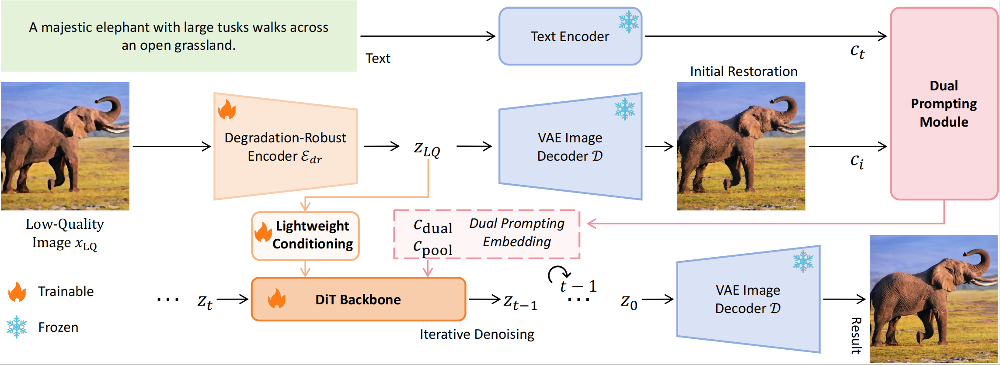

## Dual Prompting Image Restoration with Diffusion Transformers (CVPR2025)

  &nbsp;&nbsp;&nbsp;&nbsp;&nbsp;

Dehong Kong1,2, Fan Li3, Zhixin Wang3, Jiaqi Xu4, Renjing Pei3, Wenbo Li3, WenQi Ren1,2,5

1School of Cyber Science and Technology, Shenzhen Campus of Sun Yat-sen University
2MoE Key Laboratory of Information Technology 3Huawei Noah’s Ark Lab 4The Chinese University of Hong Kong
5Guangdong Provincial Key Laboratory of Information Security Technology

:star: Code is coming soon! 
If DPIR is helpful to your images or projects, please help star this repo. Thanks!

#### 🚩Accepted by CVPR2025

## 🔎 Overview framework

## 📷 Real-World Results

## ⚙️ Dependencies and Installation

    ## git clone this repository
    git clone https://github.com/kongdehong/DPIR.git
    cd DPIR

    # create an environment
    conda create -n dpir python=3.8
    conda activate dpir
    pip install -r requirements.txt

## 🚀 Quick Inference

#### Step 1: Download the pretrained models

- Download the pretrained models from...

#### Step 2: Prepare testing data

You can put the testing images in the...

#### Step 3: Running testing command

    python test_.py

## 🌈 Train

## 📧 Contact

If you have any questions, please feel free to contact: `kongdh@mail2.sysu.edu.cn`

## :notebook: License

This project is released under the [Apache 2.0 license](LICENSE).
## 🎓Citations

If our code helps your research or work, please consider citing our paper. The following are BibTeX references:

